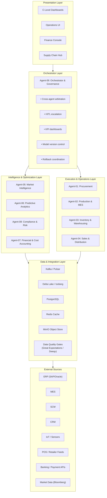

# 1. Architecture Diagram — Agent Topology, Data Flows & Communication Protocols

## 1.1 High-Level System Architecture

The system is organized as a **layered event-driven architecture** with 9 specialized agents coordinated by an Orchestrator & Governance Agent. All inter-agent communication occurs via **async pub/sub message bus** with dead-letter queues, CloudEvents format, and JSON-LD payloads.

```
┌─────────────────────────────────────────────────────────────────────────────┐
│                        PRESENTATION & INTERFACE LAYER                        │
│  ┌──────────┐ ┌──────────┐ ┌──────────┐ ┌──────────┐ ┌──────────────────┐  │
│  │  C-Level  │ │ Operations│ │  Finance  │ │  Supply   │ │  External APIs   │  │
│  │Dashboards │ │   UI     │ │  Console  │ │ Chain Hub │ │ (Trading, News)  │  │
│  └────┬─────┘ └────┬─────┘ └────┬─────┘ └────┬─────┘ └────────┬─────────┘  │
└───────┼────────────┼────────────┼────────────┼─────────────────┼────────────┘
        │            │            │            │                 │
┌───────┴────────────┴────────────┴────────────┴─────────────────┴────────────┐
│                     ORCHESTRATOR & GOVERNANCE LAYER                          │
│  ┌─────────────────────────────────────────────────────────────────────────┐ │
│  │            Orchestrator & Governance Agent (Agent-09)                    │ │
│  │  • Cross-agent arbitration     • Priority routing                       │ │
│  │  • HITL escalation              • System health monitoring               │ │
│  │  • KPI dashboards               • Model version control                 │ │
│  │  • Rollback coordination        • Circuit breaker management             │ │
│  └────────────────┬────────────────────────────────────────────────────────┘ │
└───────────────────┼──────────────────────────────────────────────────────────┘
                    │
┌───────────────────┴──────────────────────────────────────────────────────────┐
│                      INTELLIGENCE & OPTIMIZATION LAYER                        │
│                                                                              │
│  ┌──────────────┐  ┌──────────────┐  ┌──────────────┐  ┌──────────────┐    │
│  │  Market Intel │  │  Predictive  │  │  Compliance  │  │   Financial  │    │
│  │   Agent-05   │  │ Analytics    │  │  & Risk      │  │   & Cost     │    │
│  │              │  │   Agent-06   │  │   Agent-08   │  │   Acct Agent │    │
│  │ • Competitor │  │ • Forecasting│  │ • Regulatory │  │   Agent-07   │    │
│  │ • Sentiment  │  │ • Simulation │  │ • Risk       │  │              │    │
│  │ • Trends     │  │ • What-if    │  │ • Audit      │  │ • BOM Cost   │    │
│  └──────┬───────┘  └──────┬───────┘  └──────┬───────┘  │ • P&L/Margin │    │
│         │                 │                  │          └──────┬───────┘    │
└─────────┼─────────────────┼──────────────────┼─────────────────┼────────────┘
          │                 │                  │                 │
┌─────────┼─────────────────┼──────────────────┼─────────────────┼────────────┐
│         │     EXECUTION & OPERATIONS LAYER    │                 │            │
│  ┌──────┴───────┐  ┌──────┴───────┐  ┌──────┴───────┐  ┌──────┴───────┐    │
│  │ Procurement  │  │ Production & │  │ Inventory &  │  │ Sales &     │    │
│  │   Agent-01   │  │ MES Agent-02│  │ Warehouse    │  │ Distribution│    │
│  │              │  │              │  │   Agent-03   │  │   Agent-04  │    │
│  │ • Sourcing   │  │ • Scheduling │  │ • Reorder    │  │ • Order     │    │
│  │ • Vendor     │  │ • OEE/OQC    │  │ • FIFO/FEFO  │  │ • Fulfill   │    │
│  │ • Contracts  │  │ • Predictive │  │ • Dead-stock │  │ • Logistics │    │
│  └──────┬───────┘  │   Maint.    │  │ • Cross-dock │  │ • Pricing   │    │
│         │          └──────┬───────┘  └──────┬───────┘  └──────┬───────┘    │
└─────────┼─────────────────┼──────────────────┼─────────────────┼────────────┘
          │                 │                  │                 │
┌─────────┴─────────────────┴──────────────────┴─────────────────┴────────────┐
│                          DATA & INTEGRATION LAYER                            │
│                                                                              │
│  ┌──────────┐ ┌──────────┐ ┌──────────┐ ┌──────────┐ ┌──────────────────┐  │
│  │  Kafka / │ │  Delta   │ │PostgreSQL│ │  Redis   │ │     MinIO        │  │
│  │  Pulsar  │ │Lake/Iceb.│ │ (Rel.)   │ │ (Cache)  │ │  (Object Store)  │  │
│  │(Streams) │ │ (Lakeh.) │ │          │ │          │ │                  │  │
│  └──────────┘ └──────────┘ └──────────┘ └──────────┘ └──────────────────┘  │
│                                                                              │
│  ┌────────────────────────────────────────────────────────────────────────┐ │
│  │              Data Quality Gates (Great Expectations / Deequ)           │ │
│  └────────────────────────────────────────────────────────────────────────┘ │
│                                                                              │
│  ┌──────────┐ ┌──────────┐ ┌──────────┐ ┌──────────┐ ┌──────────────────┐  │
│  │  ERP     │ │   MES    │ │   SCM    │ │   CRM    │ │  IoT / Sensor    │  │
│  │(SAP/Ora) │ │          │ │          │ │          │ │    Data Feeds     │  │
│  └──────────┘ └──────────┘ └──────────┘ └──────────┘ └──────────────────┘  │
│  ┌──────────┐ ┌──────────┐ ┌──────────┐ ┌──────────┐                      │
│  │ POS/Rtlr │ │  Banking │ │ Market   │ │ Social / │                      │
│  │  Feeds   │ │ / Payment│ │  Data    │ │  Web     │                      │
│  └──────────┘ └──────────┘ └──────────┘ └──────────┘                      │
└─────────────────────────────────────────────────────────────────────────────┘
```

## 1.2 Communication Protocol

### Message Format — CloudEvents + JSON-LD

```json
{
  "specversion": "1.0",
  "type": "com.manufacturing.procurement.price-spike",
  "source": "/agents/procurement-agent/v1",
  "id": "a1b2c3d4-e5f6-7890-abcd-ef1234567890",
  "time": "2026-05-21T14:30:00Z",
  "datacontenttype": "application/ld+json",
  "subject": "raw-material/copper/price-alert",
  "data": {
    "@context": {
      "schema": "https://schema.org/",
      "mas": "https://manufacturing.mas/context/1.0"
    },
    "@type": "mas:PriceAlert",
    "materialId": "RAW-2024-CU-001",
    "materialName": "Copper C11000",
    "currentPrice": 9.45,
    "unit": "USD/kg",
    "previousPrice": 7.88,
    "percentChange": 19.92,
    "thresholdBreached": "critical-change",
    "thresholdConfig": {
      "warning": 5.0,
      "critical": 10.0
    },
    "confidence": 0.97,
    "dataSources": ["LME", "Bloomberg", "S&P Global"],
    "recommendedActions": [
      "activate-hedging",
      "explore-alt-supplier",
      "reprice-fg"
    ],
    "businessImpact": {
      "estimatedCostImpact": 245000,
      "currency": "USD",
      "affectedProductLines": ["PROD-A", "PROD-B"],
      "marginImpact": -1.2
    },
    "provenance": {
      "modelVersion": "procurement-price-v2.3.1",
      "driftCheck": "passed",
      "dataQualityScore": 0.98
    }
  }
}
```

### Topic Structure (Kafka/Pulsar)

| Topic | Producer | Consumer(s) | Retention | Description |
|-------|----------|-------------|-----------|-------------|
| `mas.events.procurement` | Agent-01 | Agent-02, Agent-03, Agent-06, Agent-07, Agent-09 | 90d | Raw material prices, vendor events, PO lifecycle |
| `mas.events.production` | Agent-02 | Agent-03, Agent-04, Agent-06, Agent-07, Agent-09 | 90d | Schedule changes, OEE, quality alerts, maintenance |
| `mas.events.inventory` | Agent-03 | Agent-02, Agent-04, Agent-06, Agent-09 | 90d | Stock levels, reorder points, dead-stock alerts |
| `mas.events.sales` | Agent-04 | Agent-03, Agent-06, Agent-07, Agent-09 | 90d | Orders, fulfillment, returns, channel data |
| `mas.events.market` | Agent-05 | Agent-06, Agent-01, Agent-09 | 30d | Competitor pricing, sentiment, macro signals |
| `mas.events.forecast` | Agent-06 | Agent-01, Agent-02, Agent-03, Agent-04, Agent-07, Agent-09 | 180d | Demand forecasts, scenario simulations, drift alerts |
| `mas.events.finance` | Agent-07 | Agent-09, Agent-08 | 365d | Cost updates, margin changes, financial reports |
| `mas.events.compliance` | Agent-08 | Agent-09, all agents | 365d | Regulatory alerts, audit triggers, risk events |
| `mas.events.orchestrator` | Agent-09 | All agents | 90d | Governance commands, HITL decisions, rollback signals |
| `mas.events.dead-letter` | Any | Agent-09 | 30d | Failed messages, retry exhaustion |

### Dead-Letter Queue Protocol

```
┌──────────┐   3 retries    ┌──────────────┐   Max retries    ┌──────────────┐
│ Producer │ ──────────────▶│  Main Topic   │ ──────────────▶│  Dead-Letter  │
│  Agent   │ ◀───────────── │  (Partition)  │     exhausted   │    Queue      │
└──────────┘    ACK/NACK    └──────────────┘                 └──────┬───────┘
                                                                    │
                                                          ┌─────────▼────────┐
                                                          │ Orchestrator     │
                                                          │ Agent-09 alerts  │
                                                          │ + HITL or retry  │
                                                          └──────────────────┘
```

## 1.3 Data Flow Architecture

```
                         ┌─────────────────────────────┐
                         │   External Data Sources      │
                         │  ┌─────┐┌─────┐┌─────────┐ │
                         │  │ ERP ││ MES ││ Market  │ │
                         │  └──┬──┘└──┬──┘└────┬────┘ │
                         └─────┼──────┼────────┼───────┘
                               │      │        │
                    ┌──────────▼──────▼────────▼───────┐
                    │     Ingestion Layer               │
                    │  ┌────────────────────────────┐   │
                    │  │    Kafka Connect / Pulsar   │   │
                    │  │    IO Connectors            │   │
                    │  └────────────┬───────────────┘   │
                    │  Data Quality Gate (Great Exp.)   │
                    └──────────────┬────────────────────┘
                                   │
                    ┌──────────────▼────────────────────┐
                    │     Processing Layer               │
                    │  ┌────────────┐ ┌───────────────┐ │
                    │  │ Stream Proc│ │  Batch ETL    │ │
                    │  │ (Flink/KSQL)│ │ (Airflow/dbt)│ │
                    │  └────────────┘ └───────────────┘ │
                    │  Data Quality Gate (Deequ)         │
                    └──────────────┬────────────────────┘
                                   │
                    ┌──────────────▼────────────────────┐
                    │     Storage Layer                  │
                    │  ┌────────────┐ ┌──────────────┐  │
                    │  │ Delta Lake │ │  PostgreSQL  │  │
                    │  │ (Iceberg)  │ │  (Relational)│  │
                    │  ├────────────┤ ├──────────────┤  │
                    │  │ InfluxDB   │ │  MongoDB     │  │
                    │  │ (Time-Sr.) │ │  (Documents) │  │
                    │  └────────────┘ └──────────────┘  │
                    │  ┌──────────────────────────────┐ │
                    │  │  Data Lineage (OpenLineage)  │ │
                    │  │  Versioning (DVC)            │ │
                    │  │  Audit Logs (WORM Storage)   │ │
                    │  └──────────────────────────────┘ │
                    └───────────────────────────────────┘
                                   │
                    ┌──────────────▼────────────────────┐
                    │     Agent Consumption Layer        │
                    │  ┌──────────────────────────────┐ │
                    │  │  Each agent reads from:      │ │
                    │  │  • Feature store (Redis)     │ │
                    │  │  • Latest snapshots (Delta)  │ │
                    │  │  • Time-series (InfluxDB)    │ │
                    │  │  • Reference data (Postgres) │ │
                    │  └──────────────────────────────┘ │
                    └───────────────────────────────────┘
```

## 1.4 Agent Communication Topology

```
                         ┌──────────────────────┐
                         │   Agent-09           │
                         │   Orchestrator       │
                         └──┬──┬──┬──┬──┬──┬──┬─┘
                            │  │  │  │  │  │  │
              ┌─────────────┘  │  │  │  │  │  └──────────────┐
              │   ┌────────────┘  │  │  │  └────────────┐    │
              │   │   ┌───────────┘  │  └───────────┐   │    │
              ▼   ▼   ▼              ▼              ▼   ▼    ▼
         ┌────────┐ ┌────────┐ ┌────────┐ ┌────────┐ ┌────────┐
         │Ag-01   │ │Ag-02   │ │Ag-03   │ │Ag-04   │ │Ag-05   │
         │Procure │ │Prod    │ │Invent. │ │Sales   │ │Market  │
         └───┬────┘ └───┬────┘ └───┬────┘ └───┬────┘ └───┬────┘
             │          │          │          │          │
             └────┬─────┘──────────┼──────────┼──────────┘
                  │                │          │
             ┌────▼────┐     ┌─────▼─────┐   │
             │Agent-06 │     │ Agent-07  │   │
             │Predict. │◀────│ Financial │   │
             │Analytics│     │ & Cost    │   │
             └────┬────┘     │ Accounting│   │
                  │          └─────┬─────┘   │
                  │                │         │
             ┌────▼────────────────▼─────────▼──┐
             │         Agent-08                  │
             │    Compliance & Risk              │
             └───────────────────────────────────┘
```

**Key communication paths:**
- **Solid lines**: Primary data/event flows (via pub/sub topics)
- **Agent-09 (Orchestrator)** : Central governance — all agents report health, receive arbitration decisions
- **Agent-06 (Predictive)** : Consumes from Agents 01–05, publishes forecasts consumed by Agents 01–04, 07
- **Agent-07 (Financial)** : Consumes cost signals from Agents 01–04, forecast from Agent-06, publishes margin/cash flow
- **Agent-08 (Compliance)** : Monitors all agents for compliance violations, publishes alerts

## 1.5 Mermaid Diagram Source (for rendering)

See [`diagrams/architecture.mmd`](./diagrams/architecture.mmd) for the Mermaid source.



## 1.6 Communication Protocol Details

### Protocol Stack

| Layer | Technology | Purpose |
|-------|------------|---------|
| **Transport** | Kafka / Pulsar | Async event streaming with persistence |
| **Message Envelope** | CloudEvents 1.0 | Standardized event format with context attributes |
| **Payload Serialization** | JSON-LD | Semantic JSON with @context for data lineage |
| **Schema Registry** | Apicurio / Confluent SR | Schema versioning, evolution, and validation |
| **RPC / Sync Calls** | gRPC (with mTLS) | Agent-to-agent synchronous queries (e.g., "what's current stock?") |
| **REST API Gateway** | Kong / APISIX | External API management, rate limiting, auth |

### Quality of Service

| QoS Level | Delivery Guarantee | Use Case |
|-----------|-------------------|----------|
| At-least-once | Default for all events | Agent state changes, forecasts |
| Exactly-once | Idempotent producers + transactional | Financial transactions, compliance events |
| Best-effort | Low-priority telemetry | Agent health metrics, debug logs |

### Dead-Letter Queue & Retry Policy

```
Retry 1: 5 seconds
Retry 2: 30 seconds
Retry 3: 5 minutes
└──→ Dead-letter queue → Orchestrator alert → HITL or circuit-breaker
```

---

*See also: [Agent Responsibility Matrix](./02-agent-responsibility-matrix.md) | [Tech Stack](./03-tech-stack.md) | [Diagrams](./diagrams/)*
